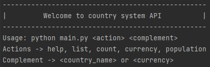
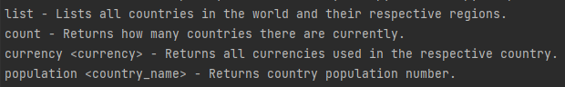

<h1 align="center">
  
   
  CountryAPI:
</h1>

---

<h4 align="center">
REST Countries API Program
</h4>

---
Execution:
=====

- To run the program type the following command:
> python main.py

- To open help menu type:
> python main.py help

---

Licensing
=====

This software is licensed under the terms of the MIT.

You can find a copy of the license in the [LICENSE file](LICENSE)